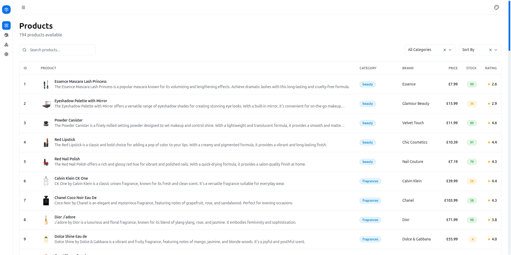
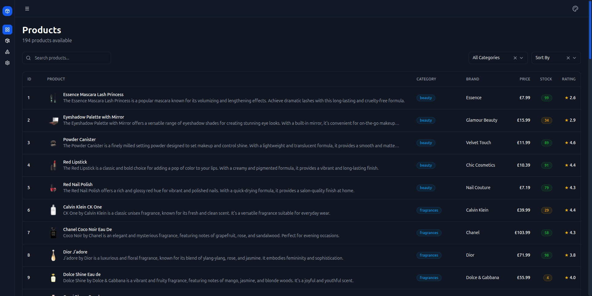
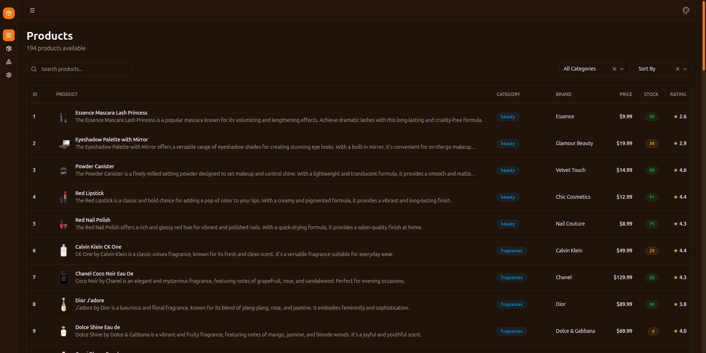
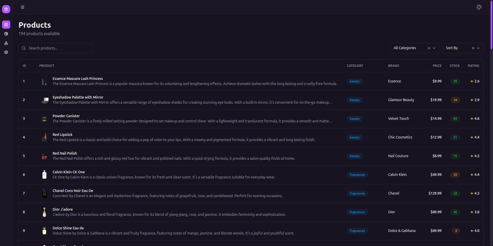
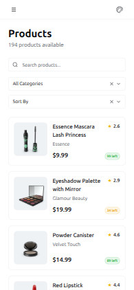
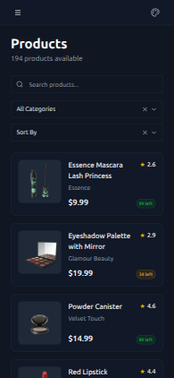

# Product Explorer Dashboard - Assessment

This project was built as part of a technical assessment. It is a product management dashboard that allows users to explore, filter, and view details of various products with a responsive and interactive interface.

## Folder Structure

```bash
src/
├── assets/             # Images and design assets
├── components/         # Shared UI components (Sidebar, Theme picker, etc.)
│   └── ui/             # Core building blocks
├── context/            # React Context (Currency management)
├── features/           # Feature-specific logic and components
│   ├── products/       # All product-related views and components
│   └── settings/       # Settings page and components
├── hooks/              # Custom reusable hooks
├── layouts/            # Page layouts
├── lib/                # External library configurations and utils
├── providers/          # App-wide providers (Theme)
├── routes/             # Routing setup
├── store/              # State management with Zustand
└── styles/             # Global CSS and tokens
```

## Getting Started

### Prerequisites

This project uses **pnpm** as the package manager. If you don't have it installed, you can install it via npm:

```bash
npm install -g pnpm
```

```bash
corepack enable
corepack prepare pnpm@latest --activate
```

### Installation & Setup

1. **Install dependencies:**

   ```bash
   pnpm install
   ```

2. **Run the development server:**

   ```bash
   pnpm dev
   ```

3. **Build for production:**
   ```bash
   pnpm build
   ```

## Assessment Questions

### 1. What trade-offs did you consciously make due to time constraints?

I would have spent more time to make the reusable components better. Specifically, I would have built a better reusable Table component where I can send data and columns, similar to TanStack Table or other popular libraries, to make it more flexible and scalable.

### 2. If this app needed to scale (more data, more features), what would you refactor first?

If the app needed to scale to show more data, the first thing I would do is make the product list virtualized. This would reduce the DOM load and improve performance. I would also spend more time on project structure by formalizing the UI components into a dedicated design system package (using Storybook) to ensure consistency as the team grows.

### 3. Did you use AI tools? If yes, which parts and how did you verify correctness?

Yes, I did use AI tools for the following:

- I used Claude to help craft the sidebar component. I really like the shadcn design system for its simplicity, so the sidebar is totally inspired by it. I then fixed some theme and floating-related issues as I went along.
- Initially, I thought about making the product table scrollable, but I felt that was too basic. I asked AI for best practices for mobile user experience when presenting lists, and I followed that advice to create a better mobile view.
- This was the second time I used `IntersectionObserver`, so I used AI to help with the implementation. This time, I took the opportunity to learn properly how it works.

**Verification**: To ensure correctness, I asked the AI to explain why it was suggesting a particular approach or if it was the correct way to do it. I then manually checked the output and tested it to ensure everything worked properly.

## Screenshots

| Blue Theme (Light)                                        | Blue Theme (Dark)                                       |
| --------------------------------------------------------- | ------------------------------------------------------- |
|  |  |

| Orange Theme (Dark)                                         | Violet Theme (Dark)                                         |
| ----------------------------------------------------------- | ----------------------------------------------------------- |
|  |  |

| Mobile View (Light)                                               | Mobile View (Dark)                                              |
| ----------------------------------------------------------------- | --------------------------------------------------------------- |
|  |  |
